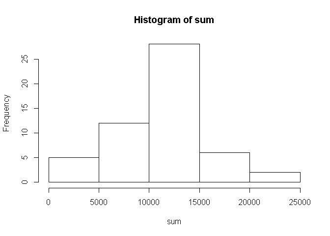
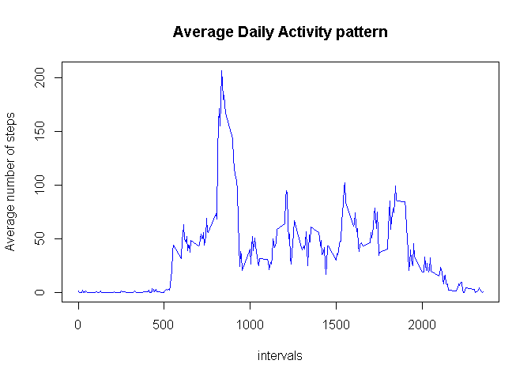
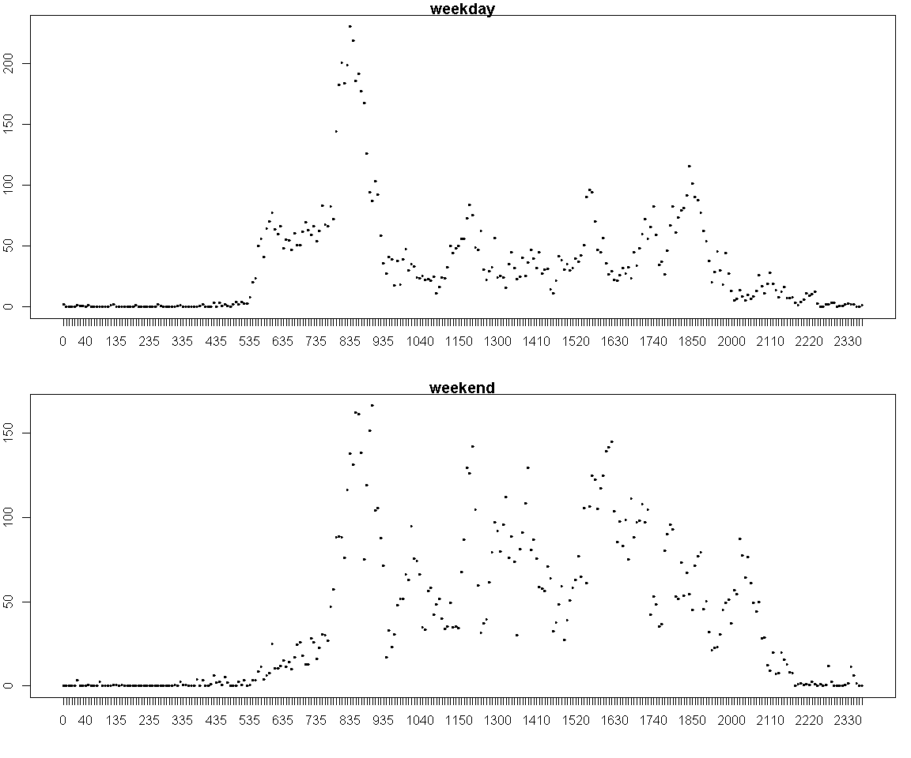

# Reproducible Research: Peer Assessment 1

## Introduction
*This document presents the research on data from a personal activity monitoring device. This device collects data at 5 minute intervals through out the day. The data consists of two months of data from an anonymous individual collected during the months of October and November, 2012 and include the number of steps taken in 5 minute intervals each day.*

## Loading and preprocessing the data


```r
#set the working directory same as the local directory with the forked repo
        setwd("C:\\Users\\Manav\\Coursera\\RepData_PeerAssessment1")
#read the data
        df<-read.csv(".\\activity\\activity.csv")
#omit the na values
        df_trunc<-na.omit(df)
```

## What is mean total number of steps taken per day?

```r
#loading required library
        library(dplyr)
```

```
## 
## Attaching package: 'dplyr'
## 
## The following objects are masked from 'package:stats':
## 
##     filter, lag
## 
## The following objects are masked from 'package:base':
## 
##     intersect, setdiff, setequal, union
```

```r
#grouping by date
        dates<-group_by(df_trunc,date)
#summarizing for calculating total number of steps for each day
        dfSums<-summarise(dates,sum=sum(steps))

#calculating mean of total number of steps
      m<-as.character(round(mean(dfSums$sum),digits = 2))

#calculating median total number of steps
      md<-as.character(round(median(dfSums$sum),digits=0))
```

### *Mean total number of steps is 10766.19 and median value is 10765.*


```r
#plotting the histogram
      with(dfSums,
           hist(sum))
```

 

## What is the average daily activity pattern?


```r
#setting up interval as factor
        df$interval<-factor(df$interval,levels=unique(df$interval),
                labels=as.character(unique(df$interval)))
#grouping by intervals
        intervals=group_by(df_trunc,interval)
#finding the means
        dfMeans<-summarise(intervals,mean=mean(steps))
#setting up the plot
        plot(dfMeans, type = "l", col="Blue", xlab = "intervals", main = "Average Daily Activity pattern", ylab = "Average number of steps")
```

 

```r
#finding the interval that has the max no. of steps
        Int_max<-as.character(dfMeans[which(dfMeans[,'mean'] == max(dfMeans$mean)),1 ])
```


### *The interval  835 contains the max number of steps on average across all days.*


## Imputing missing values


```r
# finding count of missing values
        sum(is.na(df$steps))
```

```
## [1] 2304
```

```r
#list containing all observations with NAs
        y<-which(is.na(df$steps))
        
#create a temporary dataset by merging the activity dataset with the 
#one containing the mean for a particular interval
        df_temp<-merge(df,dfMeans,df.interval=dfMeans.interval)
        
#arrange it based on date same as original dataset
        df_temp<-arrange(df_temp,date,interval)
#replace the missing values with the respective mean by using the 
#list created earlier
        df_temp[y,2]<-round(df_temp[y,4],digits=0)
#create a new dataframe with the imputed values by omitting the means column       
        df_new<-select(df_temp,1:3)
        
#group by date for calculating mean and median steps for new dataset
        dates=group_by(df_new,date)

        
# summarizing for calculating total number of steps for each day
        df_newSums<-summarise(dates,sum=sum(steps))
        
#calculating mean of total number of steps
        m<-as.character(round(mean(df_newSums$sum),digits = 2))
        
#calculating median total number of steps
        md<-as.character(round(median(df_newSums$sum),digits=0))
```

### *Mean total number of steps is 10765.64 and median value is 10762.*


## Are there differences in activity patterns between weekdays and weekends?

```r
#setting up lists for categorising as eekeday and weekend
        x <- c("Monday","Tuesday","Wednesday","Thursday","Friday")
        y<-c("Saturday","Sunday")
        
#categorising the day column
        df_new$day <- ifelse (weekdays(as.Date(df_new$date)) == x[1], "weekday",
                  ifelse (weekdays(as.Date(df_new$date)) == x[2], "weekday", 
                        ifelse (weekdays(as.Date(df_new$date)) == x[3], "weekday", 
                               ifelse (weekdays(as.Date(df_new$date)) == x[4], "weekday",
                                      ifelse (weekdays(as.Date(df_new$date)) == x[5], "weekday",
                         ifelse(weekdays(as.Date(df_new$date)) == y[1], "weekend",
                                ifelse(weekdays(as.Date(df_new$date)) == y[2], "weekend",
                                NA)))))))
 
#converting it to factor variable       
        df_new$day<-factor(df_new$day
                 ,levels=unique(df_new$day),
                            labels=as.character(unique(df_new$day)))
        
        
        
#grouping by day and interval so that we can calcuate weekday and weekend means       
        intervals1=group_by(df_new,day,interval)

#calculating the means
        daywiseMeans<-summarise(intervals1,mean=mean(steps))
```
#plotting the patterns

```r
#plotting the weekday and weekend patterns
      par(mfrow=c(2,1),mar=c(4,2,1,1))
        with(
                subset(daywiseMeans,day=="weekday"),
                plot(interval,mean,type="l",col="Red",main="weekday")
        )
        with(
                subset(daywiseMeans,day=="weekend"),
                plot(interval,mean,type="l",color="Blue",main="weekend")    
        )  
```

 


## *As is evident from the graphs there is a decided difference between activity patterns during weekdays and weekends.*
